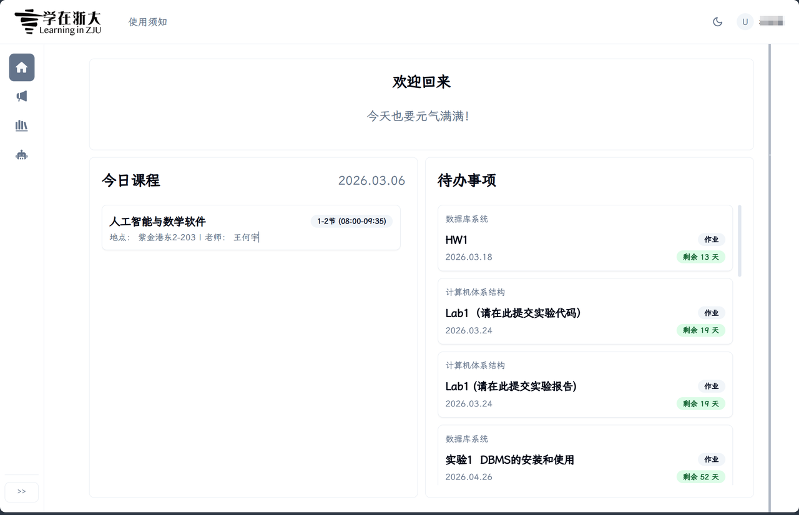
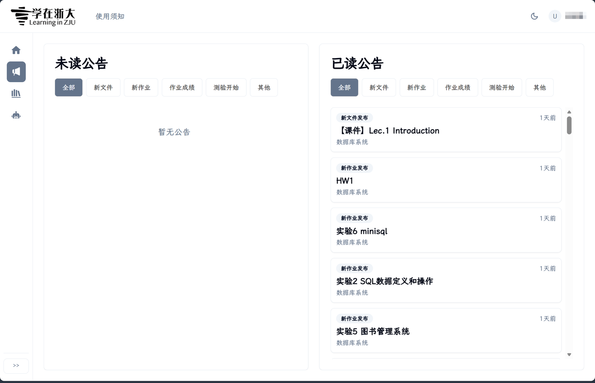
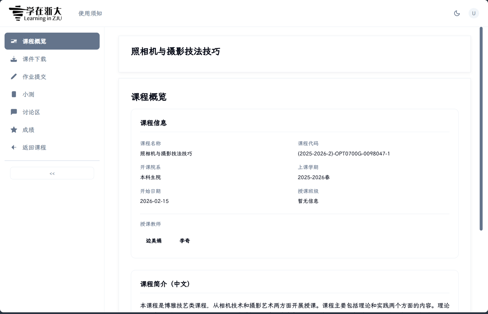
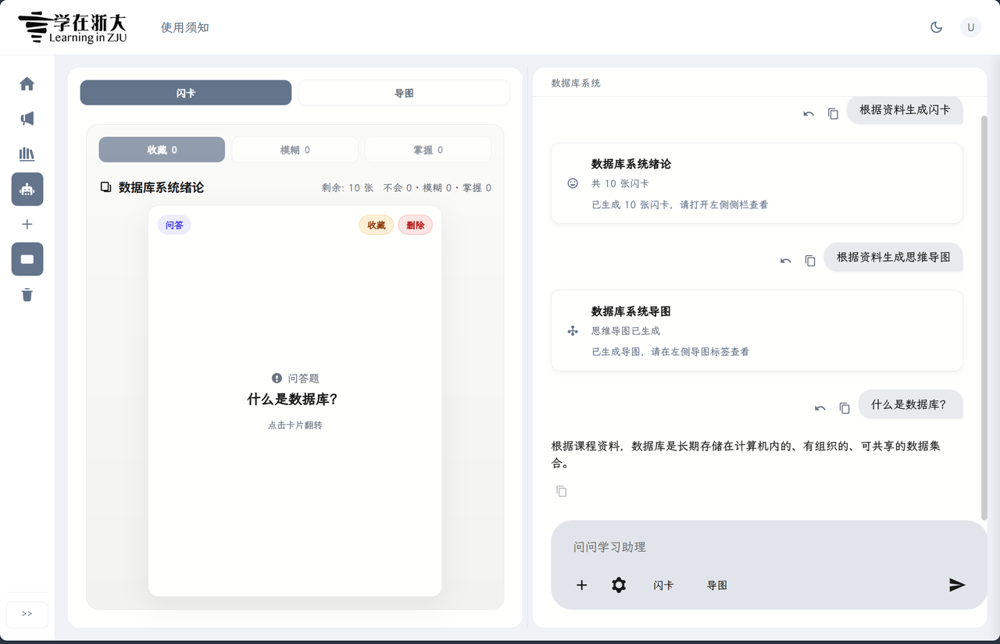
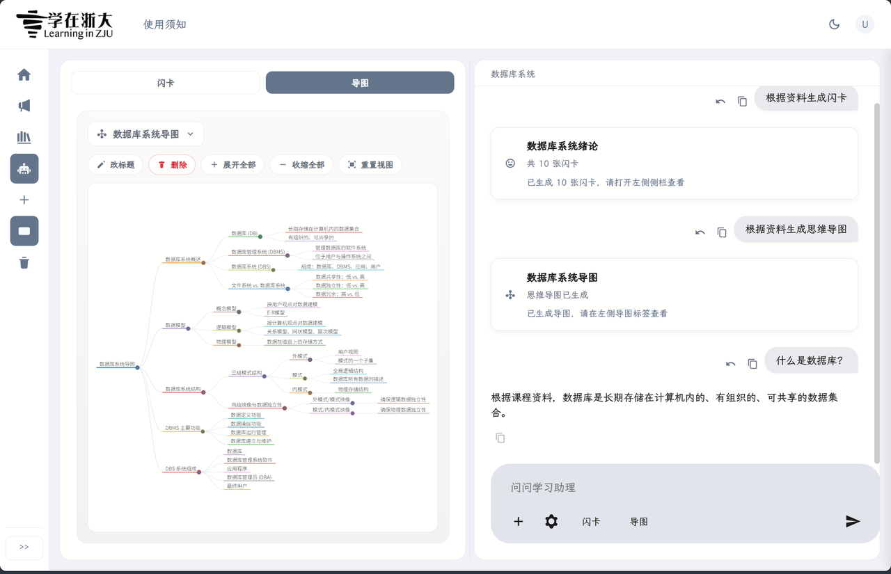

# XZZD-PRO

XZZD-PRO 是一个面向学在浙大（`courses.zju.edu.cn`）的浏览器扩展，当前主要支持 Chrome / Edge。
它直接在原页面生效，不需要登录任何第三方平台。

## 为什么做这个项目

在日常使用学在浙大时，常见问题包括：

- 查找课程与课件路径较长，点击次数多，资源获取效率低
- 作业、公告、讨论区等模块割裂，页面切换频繁
- 缺乏清晰的复习路径与框架，复习方向不够明确

XZZD-PRO 的目标是把这些高频痛点收敛到一个更顺手的使用体验里。

## 主要功能

### 1. 界面与流程重构

- 主页重排，集中展示今日课程与作业 DDL，支持快速跳转
- 公告页区分已读 / 未读，优先提示新消息
- 课程页对课件下载、作业提交等高频流程进行优化





### 2. 内置 AI 学习助理

- 可直接使用当前课程资料进行问答
- 支持生成笔记与闪卡，辅助复习
- 支持自定义 API Key，不依赖原有“浙大先生”
- 支持多模型与多平台接入：GPT、Claude、Gemini，以及硅基流动、OpenRouter、阿里云等




### 3. 其他能力

- 侧边栏支持折叠、宽度拖拽、状态持久化
- 主页组件支持拖拽分栏
- 插件选项中支持关闭美化功能

## 贡献者名单

感谢以下同学为项目做出的贡献：

[@NoughtQ](https://github.com/NoughtQ)
[@lxgswrz](https://github.com/lxgswrz)
[@RanderDouble](https://github.com/RanderDouble)

## TODO

- [x] 修复公式显示问题
- [x] 完善使用文档
- [ ] 上架插件商店
- [ ] 增加作业DDL缓存功能
- [ ] 增加课件批量下载

## 技术栈

- `Plasmo`（浏览器扩展框架）
- `React 18` + `TypeScript`
- `Tailwind CSS` + `shadcn/ui`
- `@plasmohq/storage` / `@plasmohq/messaging`
- `LangChain` provider SDK（OpenAI / Anthropic / Gemini / OpenRouter / DeepSeek 等）

## 安装方式（非开发者）

本项目尚未在插件平台上架

### 1. Chrome / Edge 离线安装

1. 在[release界面](https://github.com/xzzd-pro/xzzd-pro/releases)下载最新版扩展包
2. 打开扩展管理页：
   - Chrome: `chrome://extensions/`
   - Edge: `edge://extensions/`
3. 开启开启“开发者模式”。
4. 点击“加载已解压的扩展程序”，选择解压后的目录；或者直接将扩展包拖进本界面进行安装

### 2. Firefox 安装

1. 在[release界面](https://github.com/xzzd-pro/xzzd-pro/releases)下载最新版扩展包
2. 打开 `about:debugging#/runtime/this-firefox`。
3. 点击“Load Temporary Add-on”。
4. 选择 `build/firefox-mv3-prod/manifest.json` 完成临时安装。

> 注意Firefox 的临时安装在浏览器重启后会失效，需要重新加载。

### 学习助理配置

在第一次对话前，请在对应的设置里添加API提供商和对应的APIKey

## 开发与构建

### 1. 安装依赖

```bash
pnpm install
```

### 2. 开发模式（Chrome / Edge）

```bash
pnpm dev
```

- 打开 `chrome://extensions/`（Edge 为 `edge://extensions/`）
- 开启开发者模式
- 点击“加载已解压的扩展程序”
- 选择 `build/chrome-mv3-dev`

### 3. 生产构建

```bash
pnpm build
```

默认产物目录：

- `build/chrome-mv3-prod`

## 项目结构（核心目录）

```text
src/
  assistant/      学习助理核心逻辑（provider、上下文、聊天）
  background/     扩展后台脚本（上传等）
  components/     React 组件与 UI 组件
  contents/       各页面内容脚本入口
  lib/            页面 beautifier 与通用逻辑
  styles/         全局与页面样式
  types/          类型定义
build/
  chrome-mv3-dev/  开发构建产物
  chrome-mv3-prod/ 生产构建产物
```

## 反馈与共建

项目仍在持续迭代中，欢迎通过 Issue / PR 提出新想法与 Bug 反馈。
如果你也想要一个更好用、更顺手的学在浙大体验，欢迎试用 XZZD-PRO。
